# Overview

Tool box for experimenting with TV types.

It mostly contains a Haskell module TVToolBox with a collection of
functions to experiment with TVs, in particular TV conversion (Simple
<-> Indefinite <-> Distributional), and PLN formula application.

It also contains a bit of Maxima code pasted directly in the document
(see Section Maxima further below).

# Motivation

The reason for developing this TV toolbox, and writing it in Haskell,
is twofold (letting aside the fact that Haskell is so awesome to work
with!):

  1. I'm not entirely sure where I'm going. In spite of the PLN book
     dwelling pretty deep, there are still knowledge holes to fill, so
     I need a convenient platform to experiment on, which Haskell
     provides, due to its multi-sided scripting, native, interpreting
     nature, as well as its gnuplot binding.

  2. Haskell has pretty much unlimited integer and floating precision,
     which is very convenient to tell apart numerical errors from
     phenomenal discrepencies.

# Requirements

* ghc version 7.8.3 or above
* Libraries
  1. multimap
  2. numbers
  3. memoize
  4. gamma
  5. exact-combinatorics
  6. text-format-simple
  7. gnuplot

# Usage

To use the module see directly TVToolBox.hs for the functions it
implements. Besides that there are several files using it which
demonstrate the main functions. Each file can be directly executed as
a script (no need to compile them). Here's a short description of each
of them. For a indepth description see Section Experiment Report.

* Plot Distributional TVs given STVs

```
dtv-exp.hs
```

* Plot Indefinite TVs given STVs

```
itv-exp.sh
```

* Plot relationship between the mean of a distribution and it mode

```
mean-mode-exp.hs
```

* Plot deduction experiment using Distributional TVs

```
deduction-exp.hs
```

# Experiment Report

This section reports of a series of experiments on TV conversion and
deduction formula calculation.

## Disclaimer

I cannot make any sense of the start of Chapter 6 of the PLN book when
2 levels of sampling using Beta distributions are used to generate a
distributional TV estimate (EDIT: I think I'm partially understanding
it, see Proof p.60). Chapter 4, introducing the foundation of
distributional TV, makes perfect sense, and so this work is based on
this chapter.

Regardless of whether I eventually get it, I do intend to compare side
by side the methodology introduced in Chapter 6 with the methodology
used here. Maybe this will help me to see the light, and if not I'll
still gather knowledge to make informed implementational decisions
regarding TV conversion and formula calculation in the C++ code.

## TV Conversion

### STV to DTV

Conversion from STV to DTV is done using the formula introduced in
chapter 4, Section 4.5.1 of the PLN book.

```
P(x+X successes in n+k trials | x successes in n trials)
=
(n+1)*(choose k X)*(choose n x)
--------------------------------
 (k+n+1)*(choose (k+n) (X+x))
```

where k is the lookahead. X ranges from 0 to k (included), so the
distribution is limited to k+1 data points. For small k, it may be
convenient to generate more data points, like in order to get smoother
distributions on premises and conclusions, or calculate more precise
indefinite intervals, or even just compare with the methodology of
Chapter 6. For that we use a continuous version of the binomial
coefficient using the beta function (maybe it is a bad idea, although
according to my experiments it seems coherent).

```haskell
choose_beta n k = 1.0 / ((n+1.0) * beta (n-k+1) (k+1))
```

which gives as probability

```
P((p*100)% success in n+k trials | (s*100)% success in n trials)
=
               beta(-(n+k)*p+n+k+1, (n+k)*p+1)
------------------------------------------------------------------
(k+1)*beta(-n*s+n+1, n*s+1)*beta(- n*s+(n+k)*p+1, n*s-(n+k)*p+k+1)
```

It might be equivalent to the formula in Chapter 6. Unfortunately I
cannot make any sense of that one (s is multipled by k, while p is
multipled by n, contrary to here and previous notations in the PLN
book, and it's not just a swap, p should be multipled by (n+k). I
don't know how to fix/use it). TODO: attempt to make sense of it
anyway, or reimplement here the double sampling in the obsolete C++
PLN code (see the obsolete-C++-PLN tag on the opencog repo).

When n+k it large, this continuous version gets very imprecise (this
is an implementation limit, not a limit on Haskell's floating number
representation), so we use Haskell's binomial function `choose` that
works well on arbitrary large integers. In other words, when n+k is
small we use `choose_beta` that provides some interpolation, when n+k
is large we use `choose` that remains very accurate. That way we can
experiment with both small and large n+k.

See figures (obtained with `dtv-exp.hs`)


for 3d plots of distributions obtained from simple TVs, varying the
strength, the count and the lookahead. As you may see the
corresponding distributions are a narrower when k is low. But I don't
think this alone is a good reason to set k as a low value while doing
inferences. The real question is whether the width of the infered TVs
grows at a higher rate as measure as inferences progress when k is
high versus low. The PLN book seems to say that is the case, I
personally would like to measure that first hand.

### DTV to ITV

In order to convert a Distributional TV to an Indefinite TV we need to
find an indefinite interval [L, U] so that U-L, the width, is as small
as possible, yet takes up about the portion set by the indefinite
confidence level, b.

To do that we perform a optimization on L so that U-L is minimized and
the cumulative probability between L and U is equal to b or
greater. The optimization algo is a mere bisective search (with some
parameters to overcome the presence of noise).

See figures (obtained with `itv-exp.hs`) showing the indefinite intervals for different strengths, counts and lookaheads.


### DTV to STV

In order to convert a DTV back to an STV we need to find the strength
and the count that best fits a given distributional TV.

It may be quite important to get an accurate conversion from DTV to
STV when applying formula using DTV internally but STV externally. The
problem of course is that the DTV of a conclusion may not fit well the
an STV. However, according to preliminary experiments it seems it does
fit well, indicating that STV inference on steroid (see Section STV
Inference on Steroid) might work well enough.

For the strength we take the mode of the distributional TV, rather
than its mean. For an explanation as to why we take the mode see the
following section.

For the count we find it by optimization. The optimization here again
is a mere bisective search, and no effort is put on run-time
efficiency at that point. All fitness functions rely on generating an
STV with strength equal to the mode of the DTV, and the count being
evaluated for fitness. Three fitnesses have been tried:

1. Jensen-Shannon divergence between the DTV and the generated STV.
2. Standard deviation distance between the DTV and the generated STV.
3. Width distance between the corresponding ITV and the generated STV.

The Jensen-Shannon divergence based fitness function is supposed to be
optimal. However it is noisy (EDIT: I think this is due to some shit I
need to fix) and I suppose would only be truly optimal if the STV
strength was adjusted as well (perhaps micro-adjusted, but still).

The indefinite TV width based fitness function is the one suggested in
the PLN book, it works but it is somewhat noisy.

The standard deviation based fitness function is not noisy at all. It
may also be computationally cheaper than the other two. For that
reason it is the fitness of choice for count search.

Although our optimization algo can cope with noise, it requires a bit
of tweaking on the user's part, while optimizing a non noisy function
just works.

See figures (obtained with `deduction-exp.hs`)


for profile comparisons of the 3 fitness functions for a deduction
conclusion AC. See figures


for distributional TV and then estimated nearest STVs according to
these 3 fitness functions. As you may see the stdDev based count
optimization yield the best result in this case, clearly just due to
the fact that it doesn't have to deal with noise.

### Mode vs mean

The mean of a distribution associated to an STV differs from it's
strength. This difference is very significant when n is low, as shown
in the figure below (obtained with `mean-mode-exp.hs`).


It's been numerically observed that strength of an STV is equal to the
mode of its DTV (whenever k*x is divisible by n, or k tends to
infinity).

Here's a half-finished proof of it.

Given

```
    x
s = -
    n

    x+X
p = ---
    n+k
```

we want to proove that P (from Section 4.5.1 of the PLN book) is
maximized when `p = s`, that is

```
    k*x
X = ---
     n
```

Let's look at P:

```
P(x+X successes in n+k trials | x successes in n trials)
=
(n+1)*(choose k X)*(choose n x)
-------------------------------
 (k+n+1)*(choose (k+n) (X+x))
```

Removing constant factors we obtain

```
    choose k X
------------------
choose (k+n) (X+x)
```

We want to show that following

```
    k*x
X = ---
     n
```

maximizes it. That is for all X in [0, k]

```
    choose k X            choose k (k*x/n)
------------------ <= ------------------------
choose (k+n) (X+x)    choose (k+n) ((k*x/n)+x)
```

which is equivalent to

```
     k!/(X!(k-X)!)                   k!/((k*x/n)!(k-k*x/n)!)
------------------------- <= -------------------------------------
(k+n)!/((X+x)!(k+n-X-x)!)    (k+n)!/(((k*x/n)+x)!(k+n-(k*x/n)-x)!)
```

equivalent to

```
(X+x)!(k+n-X-x)!    ((k*x/n)+x)!(k+n-(k*x/n)-x)!
---------------- <= ----------------------------
    X!(k-X)!             (k*x/n)!(k-k*x/n)!
```

TODO: complete the proof (not very important though).

## Deduction Using DTV

We focus solely on the deduction rule for now. It is probably the most
important one in PLN, but also one of the hardest to "put on steroid"
because it has many premises, 5 in total, AB, BC, A, B, C.

To obtain the DTV of a conclusion we

1. Generate the DTV corresponding to each premises (see Subsection STV
   to DTV).
2. Sample the DTVs of all premises.
3. Check the consistency of the sampled probabilities.
4. If they are consistent, calculate the resulting strength using the
   deduction formula. Use this value as sample of the DTV's
   conclusion.
5. Convert the resulting DTV back to an STV (see Subsection DTV to
   STV).

Note that for now sampling the DTV merely is done in brute force, just
enumerating all discretized strengths weighted by their second order
probabilities, thus the resulting strength is also weighted by the
product of their second order probabilities.

TODO: possibly implement Monte Carlos sampling.


## STV Inference on Steroid

The idea of STV inference on steroid is to generate simple, efficient
and hopefully accurate inference formulae over STVs based on DTVs
internal computations. Think of a digital mixing consoles performing
internal signal processing in 48-bit while inputting and outputting
signal in 24-bit coupled with super-compilation.

Given a certain inference rule accompanied with its formula `f` it
would

1. Randomly pick input STVs, varying strengths and confidences and
   compute the resulting STV
   1. Turn them into DTVs
   2. Compute the resulting DTV using `f`
   3. Converte the resulting DTV into an STV
2. Record in a dataset all input STVs (strength and confidence) and
   their corresponding output STV. Try to gather a large number of
   individuals, ideally around `r*exp(2*m)`, with `r=10` and `m` equal
   to the number of premises.
3. Given the dataset use multivariate polynomial regression to find a
   model that accurately compute the resulting STV given the STVs of
   the premises. The model would be composed of 2 multivariate
   polynomials, one for the strength, one for the confidence.

## Further Work

Here's a description of the work that remains to be done, in more or
less the right order to go about them.

### Improve mode estimation

Naively computing the mode of a sampled distribution (picking up the
most frequent one) is lot less robust than the mean (averaging). I
noticed that this leads to more jitters and bader fits than using the
mean when the distribution is narrow. Yet the mode clearly is the
correct statistics for the strength of the corresponding STV.

One way to improve that would probably to try to fit a beta
distribution and use it's estimated mode, in fact there might just be
a formula relating the mode, the mean and standard deviation of a beta
distribution that could be used, see Subsection Relating parameters of
a Beta distribution with its mean and mode. Note that one wouldn't
need to compute the beta function at all, bypassing the beta function
limited precision issue.

The other simpler but less accurate option could be to use the mean as
an estimate of the mode when the standard deviation is sufficiently
low. But that's a bit of a hack, better go with the suggestion above.

### Make discretization have a varying step-size

So far the discretization has a constant step-size `1/resolution`. We
could make it more efficient, with larger step-sizes for low
probability regions, and shorter step-size for high probability
regions. This would increase the resolution where it matters and speed
up formula computation.

### Optimize STV to DTV for very high counts

When the count of an STV is very high, that is corresponding to a
confidence that approaches 1.0, calculating the binomial and thus the
probability distribution takes a very long time (about 10 minutes for
n=4M and k=10K). It would be good to optimize that. Clearly when a
distribution is so narrow you don't need as many datapoints as
k. Maybe this could be sampled. Alternatively the binomial itself
could be approximated and optimized. In the same vein it would be
useful to have a very efficient and accurate gamma or beta functions,
possibly replacing the need for an exact binomial.

### Implement Monte-Carlos simulation instead of full convolution

So far the DTV of a conclusion is calculated by combining virtually
all consistent discretized strengths, which is very costly.

Instead on may perform Monte-Carlos simulations, i.e. using second
order probability of a strength as the probability to pick it up.

### Try to make sense of Chapter 7 on distributional TV inference

In Section 7.2. of the PLN book it is explained how to use matrix
product and matrix inversion to perform DTV deduction and inversion. I
can't honnestly make sense of it. I supposed it is not contradictory
with the approach implemented here so far, but it feels it could
simplify and and possibly optimize computation a lot. So understanding
that part and implementing it here would be a must.

### Re-implement C++ double sampling in Haskell and compare

The obsolete C++ PLN uses a double sampling of beta distributions to
generate the DTVs. The code has been removed a long while ago but can
be found in the opencog git repository under the tag
`obsolete-C++-PLN`, under the directory `opencog/reasoning/pln`. It
would interesting to reimplement the idea here and compare it with
current single sampling approach.

### Estimate rate of DTV widening w.r.t. the lookahead

The PLN book seems to imply that the indefinite intervals tend to
widen at a more rapid rate if k, the lookahead, is large. It would be
interesting to verify that firt hand. For that we would just chain n-1
inference steps using the conclusions of the previous steps as
premises of the following steps and calculate w1/wn, where w1
corresponds to the standard deviation of the premise (or it's average
if there are more than one premise) of step 1, and wn would correspond
to the standard deviation of the conclusion of the last step.

We would obtain an average of multiple inferences of w1/wn varying the
STV of the initial premises, then look at how mean(w1/wn) varies
w.r.t. k.

### Implement STV inference on steroid

See Section STV Inference on Steriod for the details.

# Maxima

Here's a record of some work done with Maxima, symbolic manipulations
and plotting. Mostly trying to calculate and approach

```math
P(x+X successes in n+k trials | x successes in n trials)
```

and see how far ahead we can go.

## Using binomial coefficients

Here's the maxima code to estimate the pdf of DTV using the binomial
coefficients.

```maxima
P(n, x, k, X) := ((n+1)*binomial(k, X)*binomial(n, x))
              / ((k+n+1)*binomial(k+n, X+x));
```
```
// Using s=x/n and p=(x+X)/(n+k)
//
// s = x/n
// x = s*n
// p = (x+X) / (n+k) = (s*n+X) / (n+k)
// p*(n+k) = s*n+X
// X = p*(n+k) - s*n
// X+x = p*(n+k)
// p(X) = (s*n+X) / (n+k)
// p(X+1) = (s*n+X+1) / (n+k)
// p(X) - p(X+1) = 1/(n+k)
```

```maxima
P_prob(n, s, k, p) := ((n+1)*binomial(k, p*(n+k) - s*n)*binomial(n, s*n))
                        / ((k+n+1)*binomial(k+n, p*(n+k)));

pdf_k(n, s, k, p) := P_prob(n, s, k, p) * (n+k);
pdf(n, s, p) = lim k->inf pdf_k(n, s, k, p)

limit(pdf(n, s, k, p), k, inf);
```

## Using the Beta function

Same as above but the Beta function is used instead of the binomial
coefficients. Maxima is able to perform some symbolic simplifications
along the way.

```maxima
binomial_beta(n, k) := 1 / ((n+1) * beta(n-k+1, k+1));
P_beta(n, x, k, X) := ((n+1)*binomial_beta(k, X)*binomial_beta(n, x))
                  / ((k+n+1)*binomial_beta(k+n, X+x));

P_beta_prob(n, s, k, p) := ((n+1)*binomial_beta(k, p*(n+k) - s*n)*binomial_beta(n, s*n))
                        / ((k+n+1)*binomial_beta(k+n, p*(n+k)));

// Discard nonsensical p
P_beta_prob_condition(n, s, k, p) := if (0 <= (p*(n + k) - s*n) and (p*(n + k) - s*n <= k)) then (((n + 1)*binomial_beta(k, p*(n + k) - s*n)*binomial_beta(n, s*n))/((k + n + 1)*binomial_beta(k + n, p*(n + k)))) else 0;

// Simplified by Maxima
(%i44) P_beta_prob(n, s, k, p);
(%o44) beta(- (n + k) p + n + k + 1, (n + k) p + 1)
/((k + 1) beta(- n s + n + 1, n s + 1) beta(- n s + (n + k) p + 1, 
n s - (n + k) p + k + 1))

pdf_beta_k(n, s, k, p) := P_beta_prob(n, s, k, p) * (n+k);
pdf_beta_condition_k(n, s, k, p) := P_beta_prob_condition(n, s, k, p) * (n+k);

pdf_beta(n, s, p) = lim k->inf pdf_beta(n, s, k, p)
```

## Approximating the binomial

Given maxima limited large integer support we tried the following
approximation
https://en.wikipedia.org/wiki/Binomial_coefficient#Approximations

```maxima
binomial_approx(n, k) := 2^n / sqrt(1/2*n*%pi) * %e^(-(k-(n/2))^2/(n/2));
P_approx(n, x, k, X) := ((n+1)*binomial_approx(k, X)*binomial_approx(n, x))
                  / ((k+n+1)*binomial_approx(k+n, X+x));
```

turns out it is really bad, especially when n is high and k is
low. Not worth redoing.

## Some plotting commands

```maxima
plot3d(pdf_beta_k(500, 0.3, k, p), [p, 0, 1], [k, 1, 500], [grid, 100, 100], [z, 0, 100]);
plot3d(pdf_beta_k(100, 0.3, k, p), [p, 0, 1], [k, 1, 500], [grid, 100, 100], [z, 0, 100]);
plot3d(pdf_beta_k(50, 0.3, k, p), [p, 0, 1], [k, 1, 500], [grid, 100, 100], [z, 0, 100]);
plot3d(pdf_beta_k(10, 0.3, k, p), [p, 0, 1], [k, 1, 500], [grid, 100, 100], [z, 0, 100]);
plot3d(pdf_beta_k(5, 0.3, k, p), [p, 0, 1], [k, 1, 500], [grid, 100, 100], [z, 0, 100]);
plot3d(pdf_beta_k(n, 0.3, 500, p), [p, 0, 1], [n, 1, 500], [grid, 100, 100], [z, 0, 100]);
```

# Others

## Relating parameters of a Beta distribution with its mean and mode

This may turn out to be handy.

```math
mean = alpha / (alpha + beta)
mean*alpha + mean*beta = alpha
beta = (alpha - mean*alpha) / mean
beta = (alpha * (1 - mean)) / mean
beta = alpha * (1/mean - 1)

mode = (alpha - 1) / (alpha + beta - 2)
mode * alpha + mode * beta - 2*mode = alpha - 1
beta = (alpha - 1 - mode*alpha + 2*mode) / mode

(alpha - mean*alpha) / mean = (alpha - 1 - mode*alpha + 2*mode) / mode
alpha/mean - alpha = alpha/mode - 1/mode - alpha + 2
alpha/mean - alpha - alpha/mode + alpha = - 1/mode + 2
alpha (1/mean - 1/mode) = -1/mode + 2
alpha = (-1/mode + 2) * (1/mean - 1/mode)
alpha = (-1/mode + 2*mode/mode) * (mode/(mean*mode) - mean/(mean*mode))
alpha = ( (2*mode-1) / mode ) * ( (mode - mean) / (mean*mode) )
alpha = ((2*mode-1) * (mode - mean)) / (mode^2*mean)

beta = ((2*mode-1) * (mode - mean)) / (mode^2*mean) * (1/mean - 1)
beta = - ((mean - 1) (mode - mean) (2*mode - 1)) / (mean^2*mode^2)
```

TODO: Do the same for the standard deviation. The mean and standard
deviation are rather robust statistics, so this could be then handy
for estimating the mode given the beta function parameters.

## NOTES

X = a*k

(n+k) * (n + 1) * (k! / (X! (k-X)!) * (n! / x! (n-x)!)
------------------------------------------------------
      (k+n+1) ((k+n)! / ((X+x)! (k+n-X-x)!)

(n+k) * (n + 1) * (k! / (ak! (k-ak)!) * (n! / x! (n-x)!)
------------------------------------------------------
      (k+n+1) ((k+n)! / ((ak+x)! (k+n-ak-x)!)

                    (n+k) * (n + 1) * (k! / (ak! (k-ak)!) * (n! / x! (n-x)!)
pdf?(p=a) = k->inf ---------------------------------------------------------
                            (k+n+1) ((k+n)! / ((ak+x)! (k+n-ak-x)!)

f(p=a) = (n x)p^x*(1-p)^(n-x)

pdf(p=a) == f(p=a)

## Towards Correct Calculations of Confidences

In this section we attempt to improve the confidence calculations in
PLN inference rule formulas.  The goal is to get calculations which
are efficient yet justified by probability theory.  It is our belief
that the ideal calculations can only be obtained via uncomputable
integration over multiple worlds (and to that end we intend to
eventually introduce a Universal Truth Value, or UTV for short).  In
this work we suggest localized and efficient forms of such
integration, that we hope can later be formally justified as
approximations of such universal integration.

We start with the conjunction introduction rule for its simplicity.
All the code involved in these experiments can be found in
[conjunction-xp.mac](conjunction-xp.mac).

### First Attempt Uniformly Sampling Underlying Sets

A question that has been in the back my mind for a while is:

What is the probability distribution obtained from applying a rule
formula to premises which are themselves first order probabilities?

Let us for instance consider the conjunction introduction rule

```
A ≞ TVA
B ≞ TVB
⊢
(A ∧ B) ≞ TVAB
```

In order to obtain an accurate estimate of `TVAB` one would ideally
1. sample `TVA` and `TVB` to obtain first order probabilities, say
   `pA` and `pB` for a sample size of 1,
2. multiply `pA` and `pB` to obtain `pAB`, i.e. `pAB = pA*pB`,
3. repeat to 1 to get enough a large sample of `pAB` and fit whatever
   underlying distribution we choose to represent `TVAB` (like a beta
   distribution, as unfit as it may generally be).

The question in step 2 is: should we casually multiple `pA` with `pB`
to obtain `pAB`?  Meaning should we assume that `pA` and `pB` are
independent?  Or do we need to worry about the fact that we don't know
if `pA` and `pB` are independent and therefore we should instead
integrate over all possible ways that `A` and `B` could be
distributed?  Indeed, `A` and `B` could have true probabilities `pA`
and `pB` respectively, yet perfectly overlap i.e. `pAB = min(pA, pB)`,
or not overlap at all, that is `pAB = 0`, etc.  If we integrate over
all possible ways that `A` and `B` could be distributed, maybe we get
a variance that we need to account for so that instead of obtaining
`pAB = pA*pB` we obtain a distribution over `pAB`?  If this is the
case then the concluding TV `TVAB` would take into account the
variances of these "distrolets" obtained during step 2.

Given these specific premises the answer to this question is no, we do
not need to worry about integrating over all possible ways that `A`
and `B` could be distributed.  We merely can assume that they are
independent because the distrolet obtained from such integration when
the size of the universe tends to infinity tends to a Dirac delta
distribution with mean `pA*pB`.  In order words, considering all
possible ways that `A` and `B` could be distributed without any
additional knowledge about them other than the fact that they are
uniformly randomly distributed is equivalent to assuming that they are
independent!  I know it sounds obvious when phrased in that way, but
keep in mind that this is only true when the size of the universe is
infinit.

To reach this conclusion we have conducted the following experiment
using Maxima.

We begin by defining how many ways `A` and `B` could intersect with
intersection `|A ∩ B| = k`.  For that we use combinations to obtain
the following

```
Pr(|A ∩ B| = k) = binomial(a, k) * binomial(n-a, b-k) / binomial(n, b)
```

where `|A|=a`, `|B|=b` and `|U|=n` (`U` is the universe).

Let us replace `k` by `n*x`, `a` by `n*pa` and `b` by `n*pb`, where
`pa` (resp. `pb`) is the marginal probability of `A` (resp. `B`).
Using the Stirling approximation of factorial we can derive that

```
Pr(pAB = x) = (sqrt(pa*pb*(1-pa)*(1-pb)) / (sqrt(2*%pi*n*(pa-x)*(pb-x)*x*(x-pb-pa+1))))
            * ((pa**pa * pb**pb * (1-pa)**(1-pa) * (1-pb)**(1-pb))
               /
               ((pa-x)**(pa-x) * (pb-x)**(pb-x) * x**x * (x-pb-pa+1)**(x-pb-pa+1)))**n
```

Or as rendered by Maxima

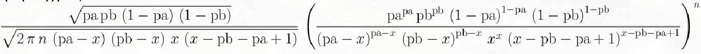

This allows us to calculate `Pr(pAB = x)` for very high values of n.

Let us start by plotting distrolets for `pA=pB=0.5` using combinations
varying `n` from 50 to 400.

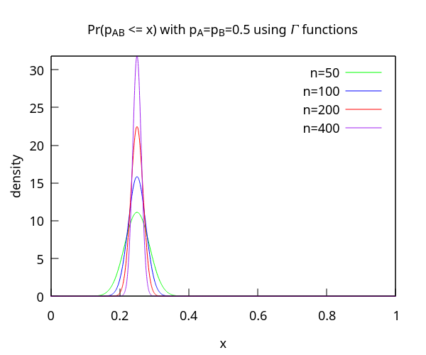

Already we can see a clear trend where the distrolet is shrinking as
`n` goes up.

Using Stirling approximation we can push `n` much larger and see that
the distrolet tends to a Dirac delta distribution.

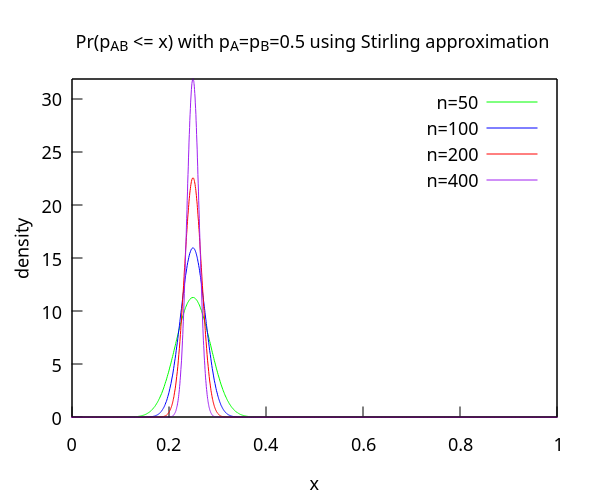
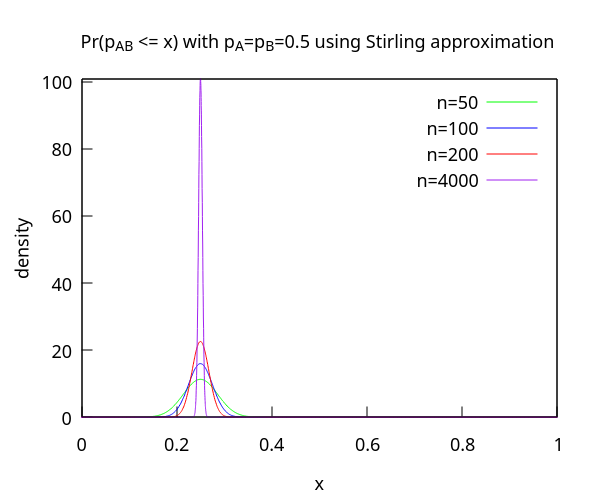
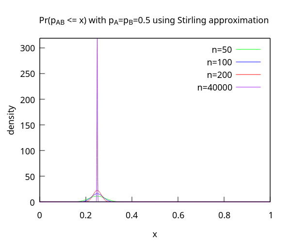
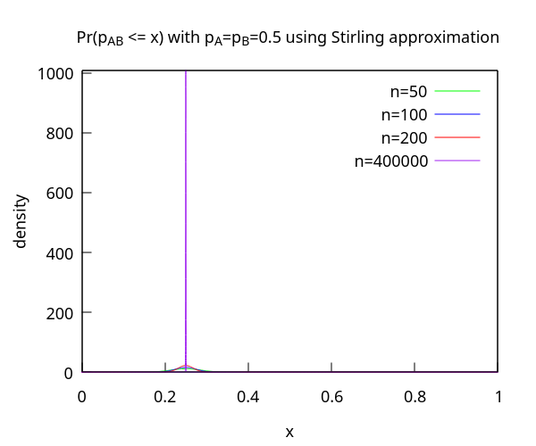
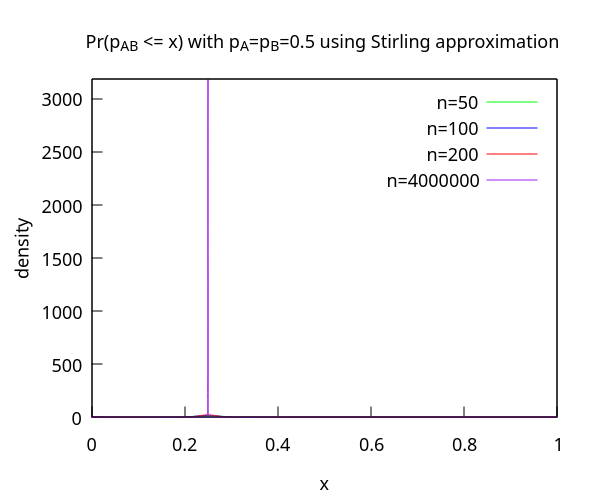

I know a rigorous proof would be better, but I think it is already
convincing enough that it converges to a Dirac delta distribution of
mean `pAB=pA*pB`.

### Second Attempt Introducing Extra Random Dependencies

Obviously the reason we obtain Dirac delta distributions is because A
and B are uniformly independently sampled, which is equivalent to
assuming that they are independent.  Indeed, as their sizes tend to
infinity all random fluctuations that may have introduce dependencies
vanish.

In this second attempt we introduce an extra premise that explicitly
states dependencies.  The conjunction introduction rule is thus
reformulated as

```
A ≞ TVa
B ≞ TVb
A → B ≞ TVab
⊢
A ∧ B ≞ TVAB
```

This formulation generalizes the one in the section above, which can
be recovered by setting `TVab = <1, 0>`, representing the absence of
knowledge about `A → B`.

If `TVab = <1, 0>`, the sampling process to estimate the second order
distribution associated to `TVAB` will still account for `A → B` but
consider a beta distribution prior, such as the Bayes' prior, to
sample from.

Like for the deduction rule, probability theory imposes some
constraints over what probabilities are possible.  Specifically, given
first order probabilities `pa` sampled from `TVa` and `pb` sampled
from `TVb`, probability `pab` sampled from `TVab` must be within the
following bounds

```
max(1+(pb-1)/pa, 0) <= pab <= min(1, pb/pa)
```

assuming that `0 < pa`, otherwise `pAB = 0` anyway.

This inequality is justified by considering the extremes within which
`Pr(A,B)` must be bound, corresponding to two situtations

1. `A` and `B` intersect the least, corresponding to `max(pa+pb-1, 0)`,
2. `A` and `B` intersect the most, corresponding to `min(pa, pb)`.

That is

```
max(pa+pb-1, 0) <= pAB <= min(pa, pb)
```

since

```
pab = Pr(A|B) = Pr(A,B)/Pr(B) = pAB/pa
```

the inequality of `pab` is obtained by dividing everything by `pa`.

Interestingly, given the localized nature introduced by these bounds,
we can resurrect the idea of replacing concluding first order
probabilities by distrolets.  Below is a plot showing such distrolets
for various values of `pa` and `pb`.

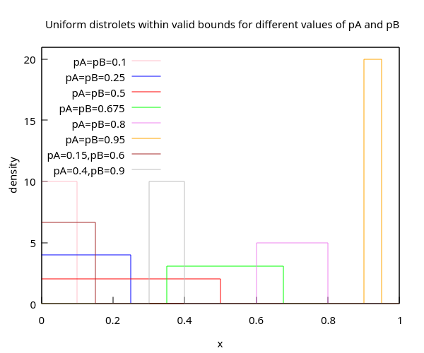

### Compare Conjunction Introduction with and without Dependencies

Let us now put all this together and build second order distributions
obtained from the sampling method described earlier, which, to sum up,
consists of sampling first order probabilities from premises, then
either apply the product or sample from distrolets to obtain first
order probability samples to build the concluding second order
distribution.

What we would like to see is how much variance in the concluding
distribution the distrolets bring vs using the independence
assumption.  To that end we produce for each pair of premises, ranging
from high to low confidence, three plots, one with independence
assumption (Dirac delta distrolet), a second derived from the extra
premise `A → B` with null confidence, i.e. a uniform distrolet with
the admissible range constrained by probability theory, a third
obtained from replacing the uniform distrolet by a bimodal
distribution with two Dirac deltas at its lower and upper admissible
extremities.  The later is hoped to emulate the most conservative
conjunction introduction, producing conclusions with the maximum
variance.

In all plots, the blue and green curves indicate the PDFs of the
premises, while the red histogram indicates the PDF of the conclusion.

We start with premises with high confidences (α=6000 and β=3000 for
the first premise, α=1000 and β=100 for the second premise).

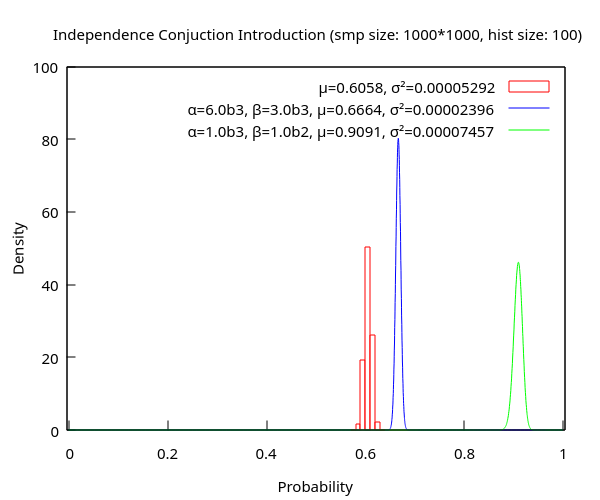
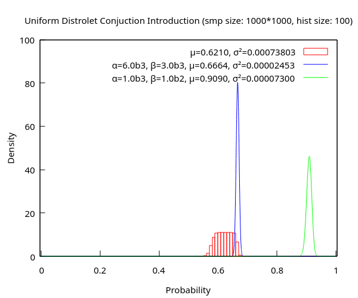
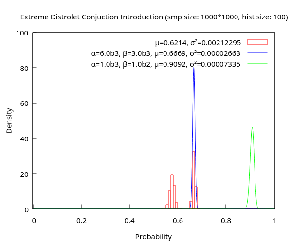

One can observe that for such high confidences the desired effect is
obtained, meaning that the variance of the conclusion using uniform
distrolets, 0.00073803, is substantially greater than that of both its
premises, 0.00002453 and 0.00007300.  It is also substantially greater
than the one obtained by making the independence assumption,
0.00005292.  The variance obtained from the extreme distrolets is even
greater, 0.00212295, but result in a bimodal distribution which is
probably not desirable.

We continue with similar premises but with reduced confidences (α=500
and β=300 for the first premise, α=100 and β=10 for the second
premise).

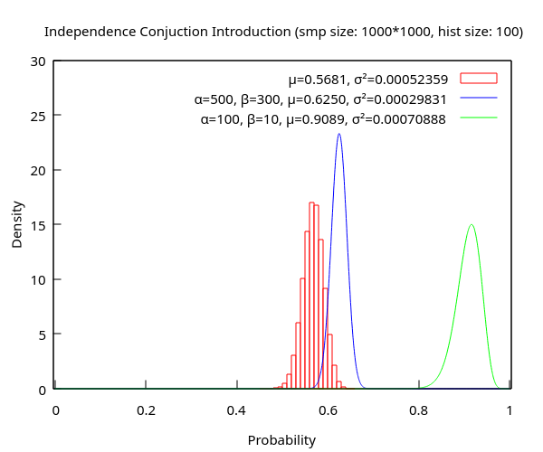
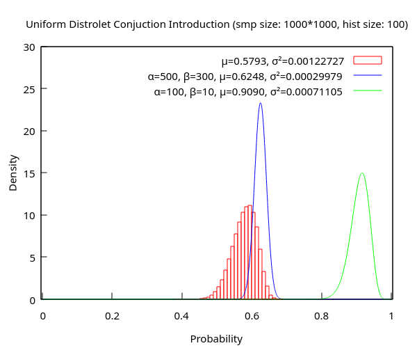
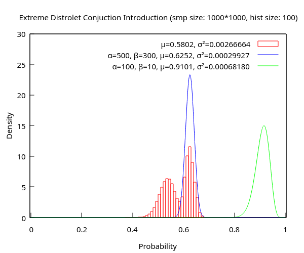

The same phenomenon, albeit less acute, can be observed, with
variances 0.00122727 for the uniform distrolets and 0.00266664 for the
extreme distrolets, greater than the variances of their premises.

In the following plots the confidence of the first premise is
substantially reduced (α=50 and β=30 for the first premise).

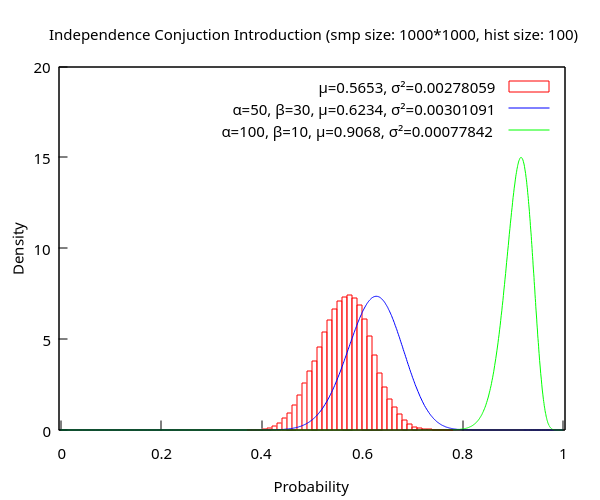
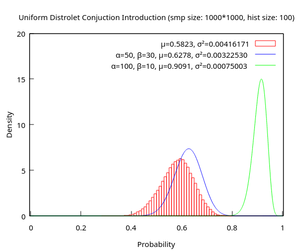
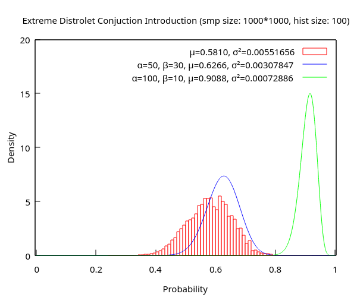

The same phenomenon is still observed albeit less acutely.

The next plots consider premises with 4 positive and 4 negative pieces
of evidence for both premises.

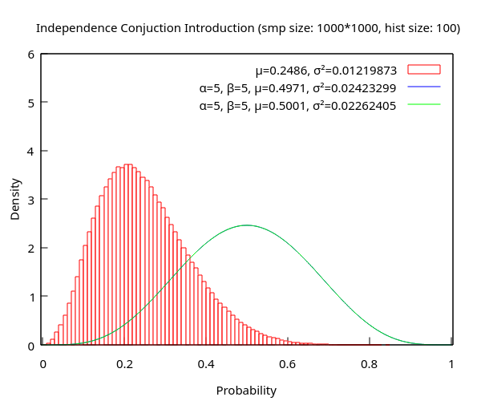
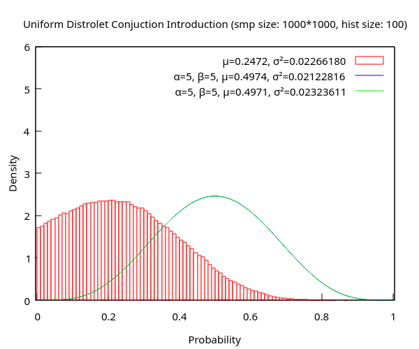
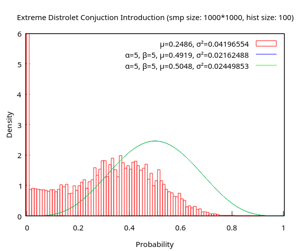

NEXT

The next plots consider premises with only positive evidence and very
low confidences.

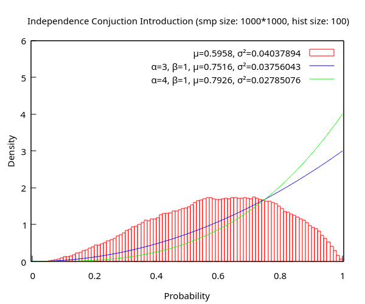
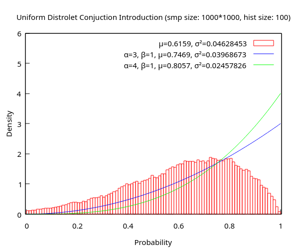
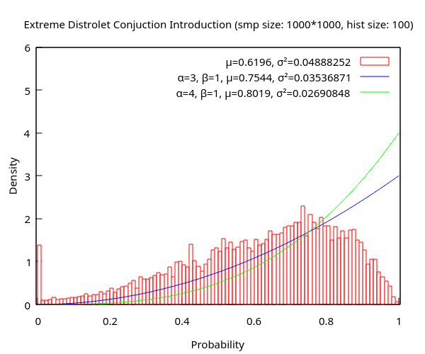

Interestingly here even the concluding variance obtained from the
independence assumption, 0.004037894, is greater than the variances of
its premises, 0.033756043 and 0.02785076.  In fact, the concluding
variances in all three cases are not far apart, with 0.04628453 for
the uniform distrolets and 0.04888252 for the extreme distrolets.  For
the latter, the extreme distrolets, one may notice a spike at 0.  This
is because when the first order sampled probabilities sum up to less
than one, zero is selected as concluding probability half of the time.

In the next plots, the premises have respectively one positive and one
negative evidence.

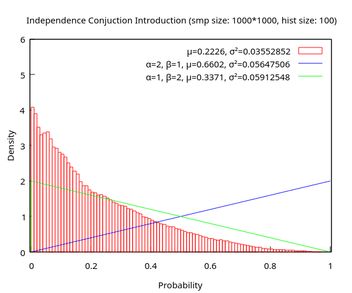
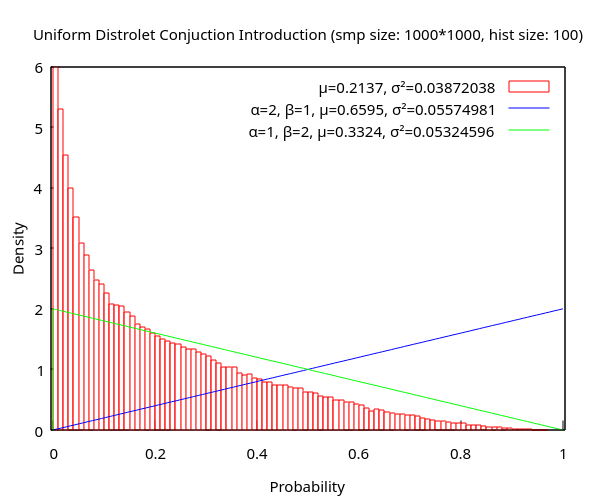
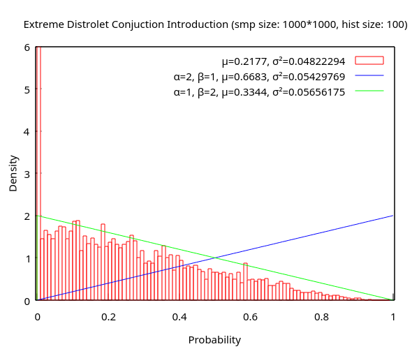

Contrary to the previous case, the concluding variances, 0.03552852
for the independence assumption, 0.03872038 for the uniform distrolets
and 0.04822294 for the extreme distrolets, are all below that of their
premises, which are approximately 0.05.  All concluding second order
distributions are shifted to the left.

These next plots show the concluding distributions when the premises
have null confidence.


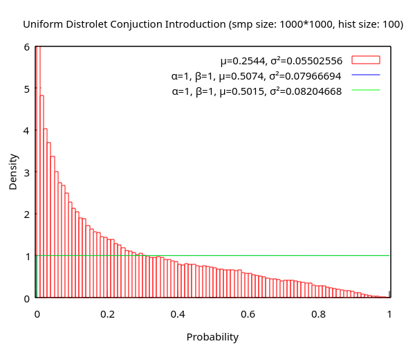
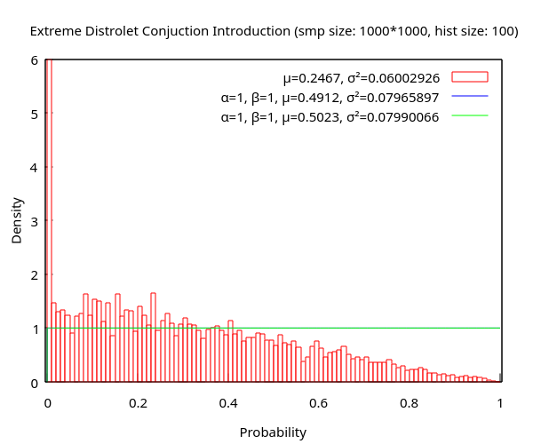

Like above, all concluding variances are less than the variances of
the premises, and all concluding second order distributions are
shifted to the left.  Clearly these second order distributions would
corresponds to simple truth values with a positive count of positive
and total evidence, while no observation has ever been made.

Let us push the experiment even further by considering other priors,
start with Jeffreys'.

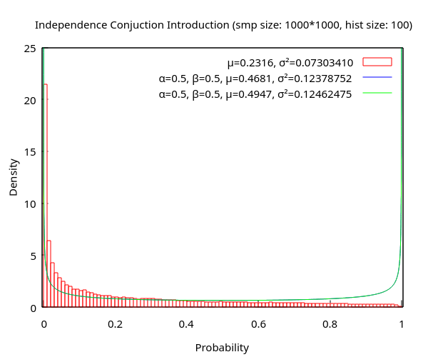

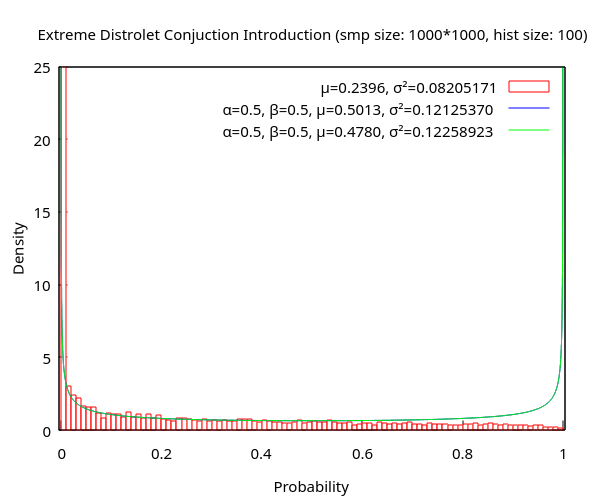

For all three cases (independence, uniform and extreme), the resulting
variances, around 0.07, are smaller than that the variances of the
premises, even more so than with a Bayes' prior.  Note that the
resulting mean, around 0.23, remains close to 0.25.  Overall the
results make sense.

Then let us consider a prior somewhere between Jeffreys and Haldane
with α=β=0.1.


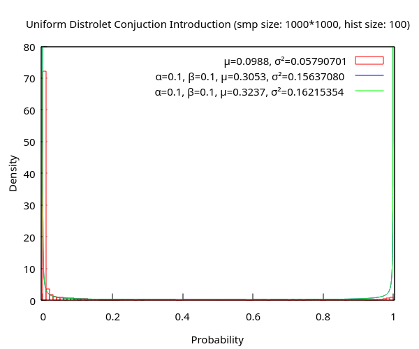
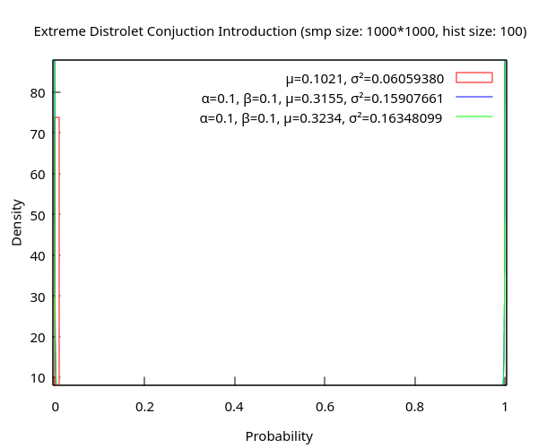

The resulting means, around 0.22, are drifting a bit away from 0.25.
One may notice that the means of premises are around 0.47 instead of
0.5, likely due to some floating point number calculation
imprecisions, so that might explain it.  But overall the results still
make sense.

Finally let us consider a prior that is getting even closer to the
Haldane prior with α=β=0.01.

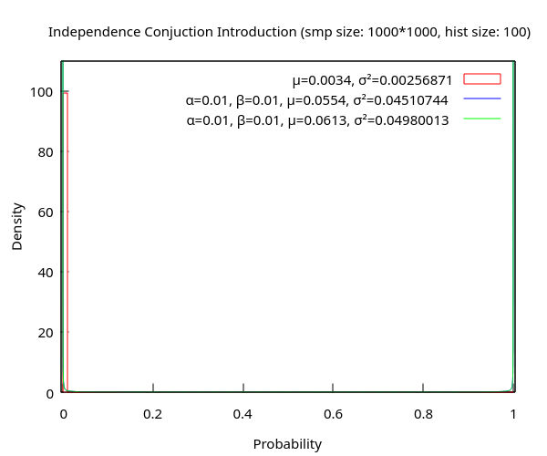
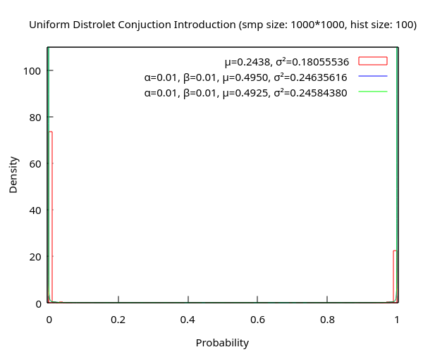
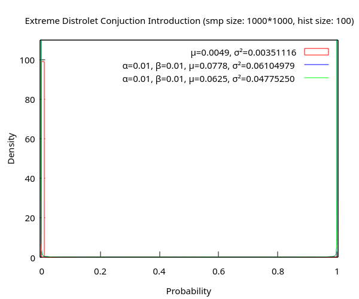

NEXT

To conclude, it interestingly seems that the structure of a composite
predicate, like a conjunction of two predicates, by itself provides
some forms of evidence.  In other words, evidence can be obtained not
just from direct observations but from composite structures as well.

### Express Dependencies with Equivalence instead of Implication

Let us explore a variation where the extra premise to capture
dependence is formulated using Equivalence rather that Implication (as
suggested in [Ben's document](PLN_AND_Confidence_Framework.md.pdf)).
In this case the inference rule for conjunction becomes

```
A ≞ TVa
B ≞ TVb
A↔B ≞ TVab
⊢
A∧B ≞ TVAB
```

The semantics of `A↔B` corresponds, in probabilistic terms, to

```
P(A∧B|A∨B)
```

Let us assume that the first order probabilities are sampled as
follows

```
pa ~ TVa
pb ~ TVb
pab ~ TVab
```

and let us examine the question of how to obtain `pAB=P(A∧B)`.

```
P(A∧B|A∨B) = P(A∧B) / P(A∨B)
P(A∧B|A∨B) = P(A∧B) / (P(A) + P(B) - P(A∧B))
pab = pAB / (pa + pb - pAB)
```

Let us express `pAB` w.r.t. to `pa`, `pb` and `pab`

```
pab = pAB / (pa + pb - pAB)
(pa + pb - pAB) * pab = pAB
pa*pab + pb*pab - pAB*pab = pAB
pa*pab + pb*pab = pAB + pAB*pab
pa*pab + pb*pab = pAB * (1 + pab)
pAB = (pa*pab + pb*pab) / (1 + pab)
```

The procedure to obtain `pAB` is therefore going to be

1. Sample `pa ~ TVa`
2. Sample `pb ~ TVb`
3. Sample `pab ~ TVab` (within valid bounds)
4. Calculate `pAB = (pa*pab + pb*pab) / (1 + pab)`

Let us assign a Bayes' prior over the second order distribution over
`TVab` when `A↔B` is completely unknown, that is a uniform second
order distribution.  We still need to sample `TVab` so that `pAB` is
within valid bounds.  To that end we attempt to derive the bounds of
`pab` given the bounds of `pAB` recalled below

```
max(pa+pb-1, 0) <= pAB <= min(pa, pb)
```

According to [DeepSeek](bound-proof-deepseek.org), we get

```
max(pa+pb-1, 0) <= pab <= min(pa/pb, pb/pa)
```

We did not go through its log to verify that its reasoning is correct.
Let us however plot `pAB` with respect to `pab` and vice versa for
various values of `pa` and `pb` while maintaining `pAB` and `pab`
within their supposedly valid bounds.

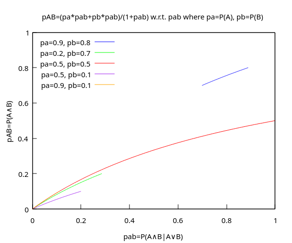
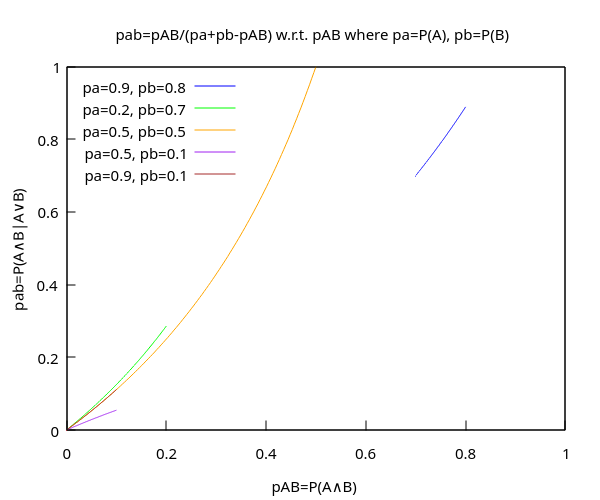

It is clear that the plots of `pAB` with respect to `pab` perfectly
mirror the plots of `pab` with respect to `pAB`, bounds included, thus
the lower and upper bounds of `pab` inferred by DeepSeek are likely
correct.

Note that since the function mapping `pab` to `pAB` is not linear,
building the second order distribution of `A∧B` via sampling `pab`
(then mapping `pab` to `pAB`) according to `A↔B` is going to yield
different results than sampling according to `A→B`.  Indeed, the
relationship between `A→B` and `A∧B` is linear while the relationship
between `A↔B` and `A∧B` is not.

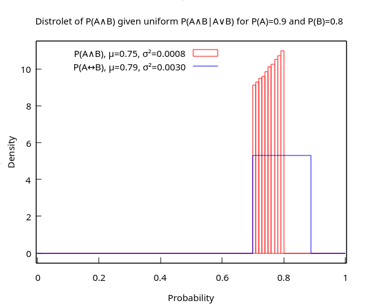
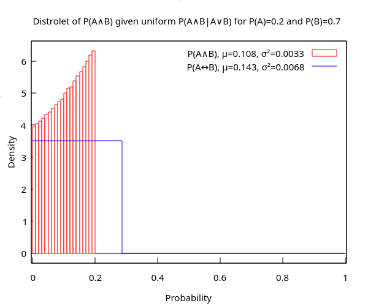
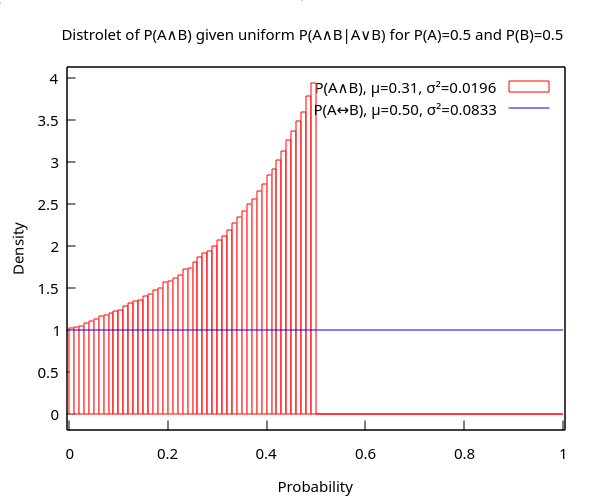
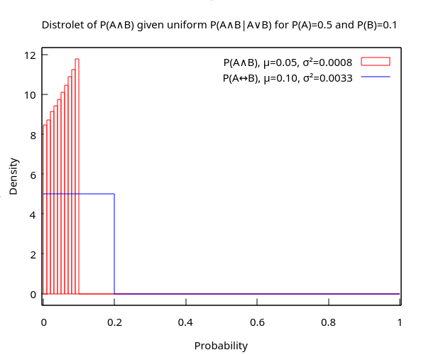
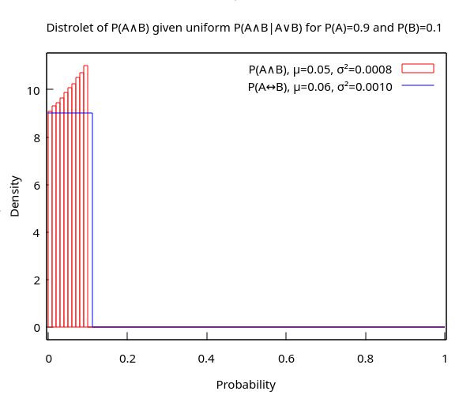

NEXT: plot second order distributions of `A`, `B`, `A↔B` to `A∧B`.
